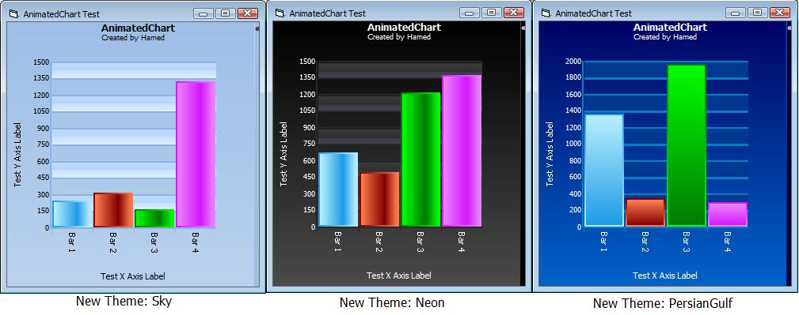



## Animated Chart

### Description

UPDATE : 2009/11/06

----

Finally, I've update this little control and now you can have it in your EXE, no need to compile as an ocx or ..., some bugs about speed of chart were fixed,

Sorry for the delay and hope you enjoy,

----

This is My Animated Chart Version 2, with 4 new themes: PersianGulf, Sky, Neon and Normal.

Some changes in animating mode, now all bars grow simultaneously instead of one by one, some bugs fixed and now you can show bars descriptions and ...

This is the first Animating Chart in PSC and I can't found any commercial instance (of course you can found some Flash Maker),

Hope you like it, I', waiting for your feedbacks and if you like this please vote,
 
### More Info
 

             |
---                |---
**Submitted On**   |2002-03-06 11:28:22
**By**             |[Hamed Oveisi](https://github.com/Planet-Source-Code/PSCIndex/blob/master/ByAuthor/hamed-oveisi.md)
**Level**          |Intermediate
**User Rating**    |5.0 (124 globes from 25 users)
**Compatibility**  |VB 6\.0
**Category**       |[Custom Controls/ Forms/  Menus](https://github.com/Planet-Source-Code/PSCIndex/blob/master/ByCategory/custom-controls-forms-menus__1-4.md)
**World**          |[Visual Basic](https://github.com/Planet-Source-Code/PSCIndex/blob/master/ByWorld/visual-basic.md)
**Archive File**   |[Animated\_C2167121152009\.zip](https://github.com/Planet-Source-Code/hamed-oveisi-animated-chart__1-70778/archive/master.zip)

